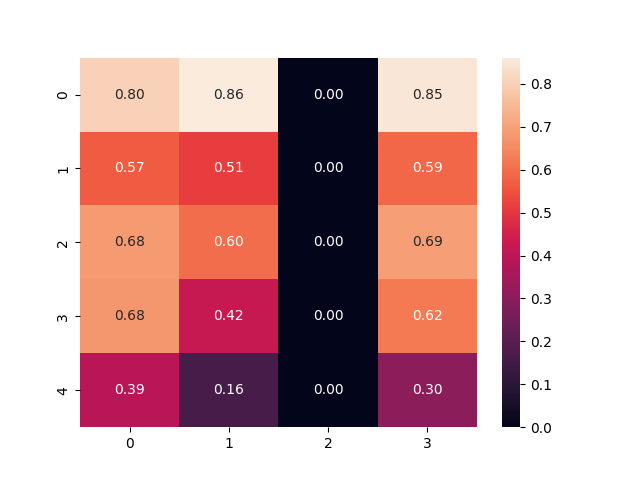

# 🎶 Impact of Music on the Human Brain  

## 📖 Introduction  
Music's universal impact on the human brain has been a constant across cultures and time.  
Recent advances in neuroscience have allowed researchers to **precisely measure how music activates every known part of the brain**, influencing **intelligence, happiness, health, and productivity** throughout life.  

This project explores the **profound influence of specific music genres** by comparing brain activity **before and after listening to music**.  
Leveraging **EEG signals captured through the MUSE 2 Headset**, the primary goal is to develop a **machine learning model** capable of discerning the nuanced impact of these genres on **human health** through in-depth brain signal analysis.  

---

##  Mission  
The mission of this project is to understand **how music affects human health and well-being** through the analysis of brain signals.  

By studying the impact of specific music genres on brain activity, we aim to provide insights that can:  
- 🧠 Enhance **future research** in neuroscience and psychology  
- 🏥 Support **clinical practices** in cognitive and emotional therapy  
- 🎵 Enable **therapeutic interventions** in music therapy  

---

## 📊 Results & Observations  

The analysis of EEG signals before and after listening to music revealed **clear neural changes across different brainwave bands**:

### 🔹 Heatmap Analysis  
- Certain brainwave measures showed **strong correlation** (0.80–0.86).  
- One feature showed **no correlation** (0.00), indicating selective activity.  
- Suggests that **music selectively synchronizes brain functions**.

  

---

### 🔹 Band-Wise EEG Comparison  

#### 🌀 Delta Band  
- **Before**: Higher activity  
- **After**: Reduced, scattered  
- 👉 Suggests **deep relaxation**  

#### 🌊 Theta Band  
- Clear reduction after music  
- 👉 Indicates **stress relief and calmness**  

#### 🌞 Alpha Band  
- Increased stability and strength  
- 👉 Reflects **focus, clarity, and relaxation**  

#### ⚡ Beta Band  
- Significantly lower after music  
- 👉 Suggests **reduced anxiety and lower cognitive load**  

#### 🔮 Gamma Band  
- Stronger synchronization after music (0.82–0.99 correlations)  
- 👉 Associated with **learning, memory, and enhanced cognition**  

---

✅ These findings highlight the **therapeutic potential of music**, showing measurable improvements in relaxation, focus, and cognitive function.  

✨ *This repository documents the journey of exploring how music shapes the human brain through science, data, and technology.*  

 
